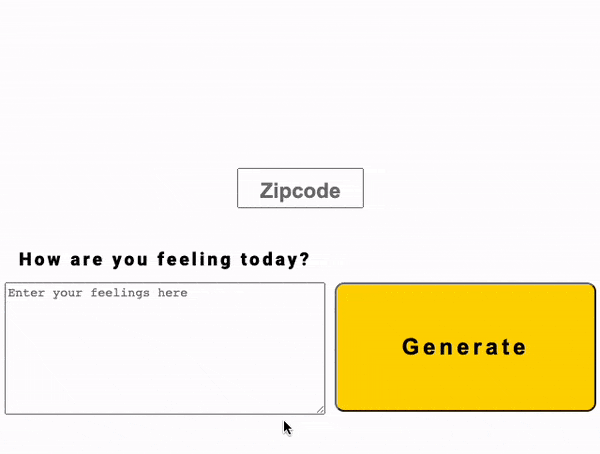
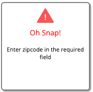

# Weather-Journal App Project

## **Overview**

The project in its entirety is an asynchronous web app that uses Web API and user data to dynamically update the UI. A user is required to enter a Zipcode and some text into inputs where it will call the *OpenWeather* API to obtain weather information and push that data to the server.

## Preview

Below is a preview of the hover state of the page logo

Below is a preview of the main UI and how the styling/layout change when the weather data is obtained/displayed

Below is a preview of the data modal. When first visiting the site, the left corner of the footer will not display any button. Once the generate button is clicked and weather data is successfully obtained a link will reveal itself and allow one to click it to reveal the modal of data that was submitted.

Below is a preview of the Error modal which appears for about 5 seconds towards the bottom right corner when an error is received from not filling in the inputs or when an error is thrown.

## Technologies/Languages Used
* HTML
* CSS
* CSS: Animation/Transition
* JavaScript
* fetch
* Promises
* Express
* bodyParser
* cors
* Node JS
* Nodemon

## Routes

### GET
---

| Request Type | Route              | Description                             | Required Request Fields   |
| ------------ |--------------------| --------------------------------------- | ------------------------- |
| `GET`        | / data            | Obtain JSON of *projectData* var users                | N/A                       |
| 

### POST
---

| Request Type | Route              | Description                                     | Required Request Fields |
| ------------ |--------------------| ----------------------------------------------- | ----------------------- |
| `POST`       | / addEntry            | Push client/UI data to *projectData* object var                                 | *name*, *link*          |
|

## Running the Project
---

`npm i` - install all necessary depencies for project.

`npm start` — to launch the server.
